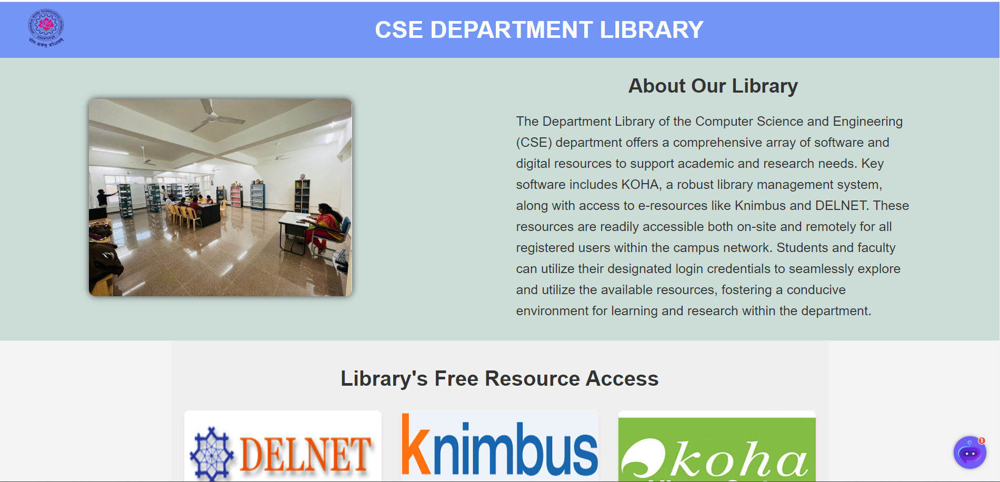

  

<h1 align="center">JNTUA College CSE Department Library Website</h1>

Welcome to the JNTUA College Computer Science and Engineering (CSE) Department's library website! Explore our extensive collection of books, journals, and digital resources curated to support your academic journey. Engage with Botsonic, our friendly chat bot, for personalized assistance and recommendations. Seamlessly access a wealth of information to enhance your research experience.

  

## 📚 Features

- **Vast Collection:** Explore a wide range of books, journals, and digital resources tailored to support your studies in computer science and engineering.

- **Botsonic Assistance:** Interact with Botsonic, our chat bot, for personalized assistance and recommendations.

- **Convenience:** Access our library's resources conveniently from any device, anytime, anywhere.

## 🚀 Getting Started

To get started with our library website, simply visit [(https://dineshkuddana.github.io/CSELibrary/)] and start exploring our collection. You can also engage with Botsonic by clicking on the chat icon located on the bottom right corner of the website.

## 🌟 Contributing

We welcome contributions to improve our library website. If you have any suggestions, feature requests, or bug reports, please submit them through our [GitHub repository] https://github.com/DineshKuddana/CSELibrary.

## 📝 License

This project is licensed under the [MIT License](LICENSE).

## 📧 Contact

For any inquiries or support, please contact us at [cse-library@jntua.ac.in](mailto:cse-library@jntua.ac.in).

---

  

